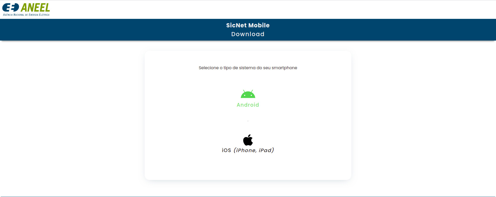
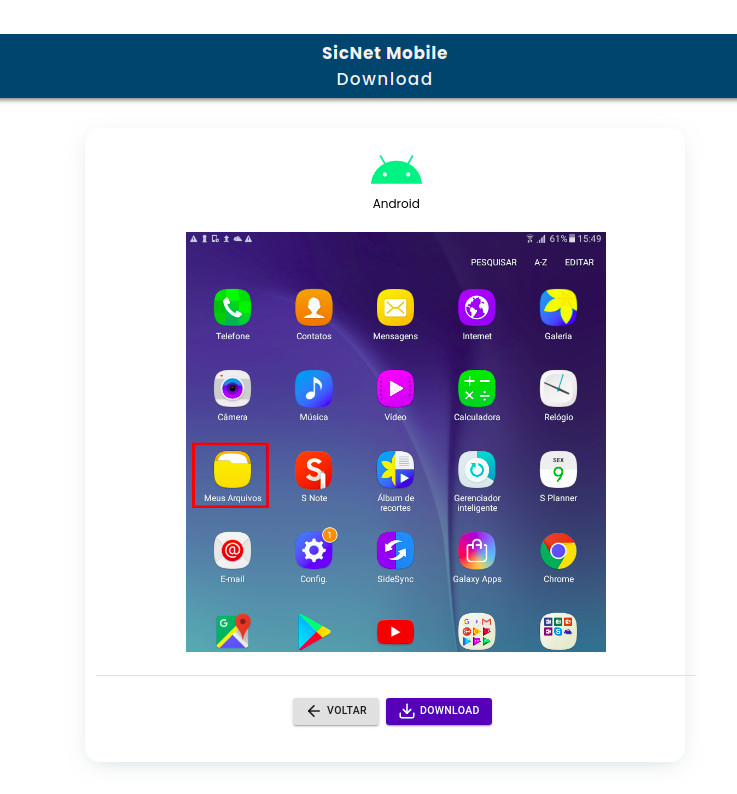
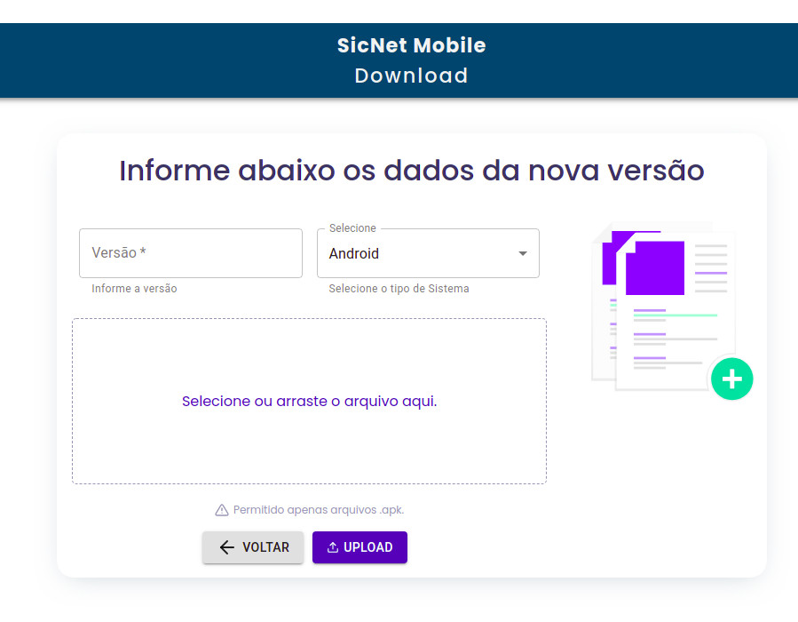
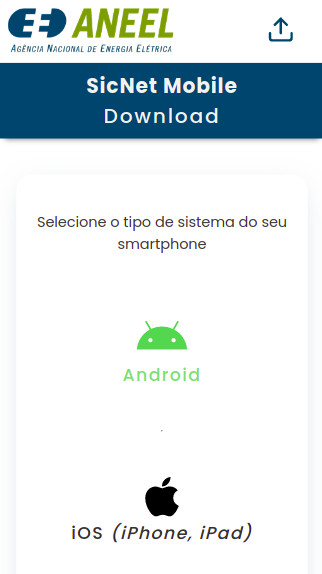
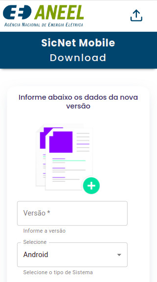

## Sicnet Mobile WEB

    
     
     

   See the project on production:
   <a href="https://sicnetmobile.netlify.app/" rel="noopener noreferrer" target='_blank'>https://sicnetmobile.netlify.app/</a>

---

   

   Home

   

   Android

   

   Upload new version

   

   Home - Mobile

   

   Upload - Mobile

---

# :pushpin: Table of Contents

- [About](#information_source-about)
- [Features](#rocket-features)
- [Installation](#construction_worker-installation)
- [Getting Started](#runner-getting-started)
- [FAQ](#postbox-faq)
- [License](#closed_book-license)

 

# :information_source: About

This web app is basically an internal app store to download a an in house developed app for Android and iOS systems. The users access the store and download the app to their smarthphones.
The admins can include new versions of the app, and then it is avaliable to download by the users.

# :star: Technologies

| Frontend                                                  |
| --------------------------------------------------------- |
| [React](https://reactjs.org/)                             |
| [Typescript](https://www.typescriptlang.org/)             |
| [React Hooks](https://reactjs.org/)                       |
| [styled-components](https://styled-components.com/)       |
| [Material-UI](https://material-ui.com/pt/)                |
| [react-icons](https://react-icons.github.io/react-icons/) |
| [axios](https://github.com/axios/axios)                   |
|                                                           |
|                                                           |

# :construction_worker: Installation

**You need to install [Node.js](https://nodejs.org/en/download/) and [Yarn](https://yarnpkg.com/) first, then in order to clone the project via HTTPS, run this command:**

`git clone https://github.com/jonatasoc/sicnet_mobile_web.git`

SSH URLs provide access to a Git repository via SSH, a secure protocol. If you have a SSH key registered in your Github account, clone the project using this command:

`git@github.com:jonatasoc/sicnet_mobile_web.git`

**Install dependencies**

`yarn`

# :runner: Getting Started

After that, run the following command in order to start the application in a development environment:

`yarn start`

# :closed_book: License

Released in 2021
This project is under the MIT license
